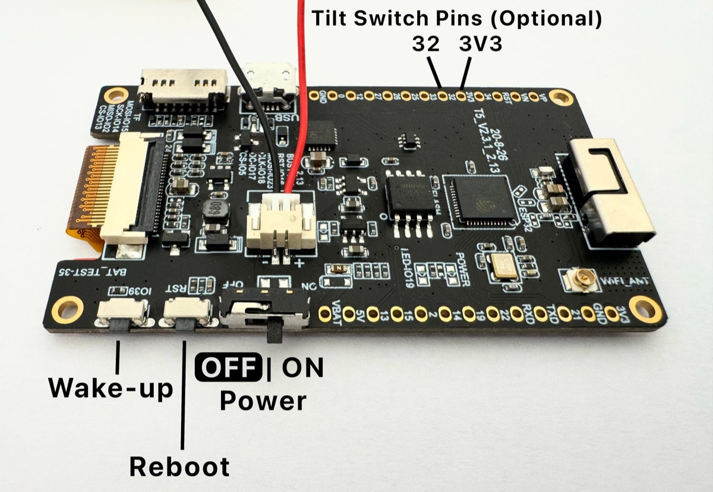
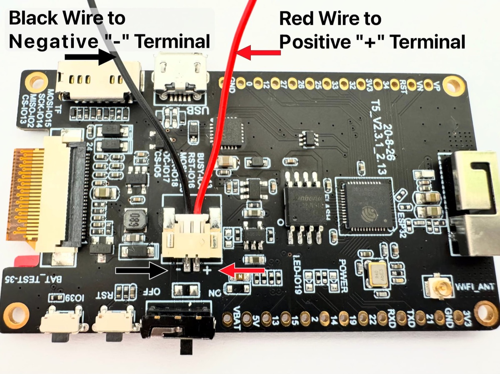

> For Lightning Piggy v2 click [here](/build/v2)!
Making your very own Lightning Piggy is squealy easy. Here are the steps you need to follow:

1. Source the parts.
2. Create a wallet.
3. [Flash](https://lightningpiggy.github.io/?ref=lightningpiggy.com) the firmware.
4. Make a [case](/build/cases) and assemble the parts.

💡IMPORTANT: This is not a toy. It contains small parts which could be a choking and ingestion hazard. There are also sharp edges. It should not be handled by children under 4 years of age. Assembly and use of this product is at your own risk. We take no responsibility for any losses that may be incurred.
---

## Quick Start Guide

If you already have the single board computer.

Choose a wallet that supports Nostr Wallet Connect (NWC). We recommend [Alby Hub](https://albyhub.com/) because it's self-hosted; supports multiple friends and family accounts, and is super easy to use. Once setup, make a copy of the **Lightning Address** and **NWC link**, you’ll need them in the next step.

Next flash the firmware. You’ll need:

- A Wi-Fi enabled laptop/desktop computer.

- A browser that supports the Web Serial API (such as Google Chrome, Brave, Opera, or Microsoft Edge).

- Your Lightning Piggy configuration details (summarised below) ready to copy and paste into the setup webpage.

**Connection**
**Required Credentials**

**WiFi**
- **SSID**   
 - **Password**

**NWC**
- **NWC link** e.g., `nostr+walletconnect://ba80990666ef0b...`   
 - **Lightning address** e.g., `LightningPiggy@coinos.io`

Use our custom-built web installer to configure and flash the firmware onto your device. Once installed, the device will automatically reboot with its Wi-Fi access point enabled, allowing you to connect and complete the configuration. Just follow the on-screen instructions. Otherwise, to enter 'access point' mode, press and hold the IO39 (Wake-up) button done for at least 3 seconds.


*Lightning Piggy's Controls*
[Web Installer](https://lightningpiggy.github.io/)Starting from version 5, your Piggy will remember its configuration settings - even after a software update. So you won’t need to re-enter them, as long as you don’t choose to erase the device during installation.

To access Piggy’s configuration settings, follow these steps:  

**1.	Activate Piggy’s Wi-Fi access point:** From another device (e.g., a laptop or smartphone), hold down Piggy’s IO39 (Wake-up) button for at least 3 seconds.  

**2.	Connect to the “Piggy Config” Wi-Fi network:** After a few seconds, a new Wi-Fi network called “Piggy Config” should appear. Connect your device to it.  

**3.	Open the configuration page:** In your browser, go to: http://<"IP address of your Piggy">/ (The IP address will typically be something like 192.168.4.1.).

Notes  

•	Some operating systems may automatically disconnect from the Piggy network since there is no internet connection. If this happens, simply reconnect and continue configuring.  

•	If you’re powering the Piggy via USB, you can enable the “Always run webserver” option in the settings. This keeps the Wi-Fi access point active, making it easier to reconnect anytime.

---

## Full Guide

### 1. Source the parts

**Single Board Computer (SBC):** LILYGO T5 V2.3.1 e-paper device with a 2.13 inch screen (DEPG0213BN) and a 9102 chip. Available direct from [LILYGo](https://www.lilygo.cc/lightningpiggy) or from resellers.

**Rechargeable battery:** Voltage: 3.7V Connector: JST 2pin 1.25mm. Available from...

- [Rokland](https://store.rokland.com/products/3-7v-1100mah-lithium-rechargeable-battery-1s-1c-lipo-battery-with-protection-board-with-micro-jst-1-25-plug?_pos=1&_sid=9c49fadc8&_ss=r) 1100mAh.

- [Aliexpress](https://www.aliexpress.com/item/32863844546.html) 1200mAh.

- [MakerFocus](https://www.makerfocus.com/products/4pcs-952540-3-7v-1000mah-battery-with-jst1-25-connector-lithium-rechargeable-battery) 1000mAh. Note: The size of this battery 26 * 44 * 9 mm (1.02 * 1.73 * 0.35 inch) doesn't fit perfectly in the Genesis and Robotechy pig cases.

**Case:** One homemade case using materials of your choice.

**Micro USB data cable:** Available cheaply for bulk purchases from [Aliexpress](https://www.aliexpress.com) or [Amazon](http://amazon.com) if you don't have one lying around.

💡IMPORTANT: Improper assembly and/or the use of improper/faulty batteries can present a fire hazard. We recommend using only high quality LiPo rechargeable batteries.***Before*** connecting the battery check the connector is correctly wired. The red wire needs to align with the positive "+" terminal, and the black wire needs to align with the negative "-" terminal. If the battery you have sourced has the polarity switched, it's possible to swop the wires by carefully lifting the plastic JST connecter retainers.


******Before*****connecting the battery check the connector is correctly wired.*
Note: The device can operate without a battery if powered via using the micro USB port.

Here's an image showing your piggy's controls:


*Lightning Piggy's Controls*
If you’d like to add a tilt switch, simply solder it between pins 32 and 3V3. Any standard tilt switches will work; for example, the SW-520D ball switch is a suitable option.

### 2. Create a Wallet

Choose one of two options for connecting your piggy:

**Use a Nostr Wallet Connect (NWC)-enabled wallet. Or, set up an LNBits wallet.**

[**NWC**](https://nwc.dev/) is a protocol that lets you securely link your Bitcoin wallet to applications without exposing your private keys, making it a simple and safe option.

[**LNBits**](https://lnbits.com/) is a versatile wallet and payment processing system for the Lightning Network, offering more control and customisation.

Below is a detailed comparison of both options to help you choose the best fit.

**NWC**
**LNBits**

**Purpose**
Protocol for connecting Lightning wallets to apps via Nostr
Multi-wallet Lightning account system

**Prerequisites**
Works with Nostr, no server required, just a NWC-compatible wallet
Requires hosting a server (trustless) or using a hosted instance (trusted)

**Ease of Use**
**Easy!** Copy and paste NWC link to connect a wallet
Requires the setup of, or access to, an LNBits instance

**Custodianship**
Both non-custodial and custodial options, the Lightning Piggy software only views payments
Both non-custodial (if self-hosted) and custodial (if using a hosted instance)

**Wallet Support**
Works with any NWC-enabled wallet (See below)
Internal to LNBits but can also be connected to a NWC-enabled wallet through LNbits

**Best For**
Great for connecting a regular NWC-enabled wallet with your piggy
Self-hosted Lightning wallets, managing multiple accounts from one interface, access to additional extension-based LNBits functionality

### Nostr Wallet Connect

Choose an NWC-enabled wallet and follow the provider’s setup instructions. Below is a summary of some popular wallet options.

Wallet
**Description**

[Alby Hub](https://albyhub.com/)
A self-custodial, open-source lightning wallet that connects to apps

[Cashu](https://wallet.cashu.me)
A free and open-source Bitcoin wallet that uses ecash

[Coinos](https://coinos.io/)
A free custodial web wallet and payment page

[Primal](https://primal.net/)
A popular nostr client with integrated custodial wallet

[Zeus](https://zeusln.com/)
A self-custodial, open-source Bitcoin wallet

Go to the NWC information page in your chosen wallet (usually found in the settings). Locate and copy the NWC link, which should follow this structure:

```
nostr+walletconnect://f3a192b445cd7e8f2d4a60c578eb932a57b83d9265fa790042bd865937c2e5d9?relay=wss%3A%2F%2Frelay.example.com&secret=11d4fc982746ab5389f75efc3ddaa94761e35fb209ec8d7a4b3d248ac4e6f710&lud16=RandomWallet@domain.com
```
Keep a record of your wallet’s Lightning address (which resembles an email address), as it will be used to receive bitcoin payments over the lightning network. This address will be automatically converted into a QR code and displayed on the Piggy's screen for easy scanning.

### LNbits

If you wish to run a LNbits wallet, please refer to our detailed [guide](/build/lnbits) for step-by-step instructions.

### 3. Flash the firmware

You’ll need a Wi-Fi enabled laptop/desktop computer, a browser that supports the Web Serial API (such as Google Chrome, Brave, Opera, or Microsoft Edge), and your Lightning Piggy configuration details (summarised below) ready to copy and paste into the setup webpage.

**Connection**
**Required Credentials**

**WiFi**
- **SSID**   
 - **Password**

**NWC**
- **NWC link** e.g., `nostr+walletconnect://ba80990666ef0b...`   
 - **Lightning address** e.g., `LightningPiggy@coinos.io`

**or LNBits**
- **Server name** (e.g., `https://demo.lnpiggy.com`)   
 - **Invoice/read key** (e.g., `db400dfba...`, copied from your LNBits Wallet API toggle)

Use our custom-built web installer to configure and flash the firmware onto your device. Once installed, the device will automatically reboot with its Wi-Fi access point enabled, allowing you to connect and complete the configuration. Just follow the on-screen instructions.

[Web Installer](https://lightningpiggy.github.io/)If you don't see the Lightning Piggy access point in your available Wi-Fi networks after updating the software, simply press and hold the IO39 (Wake-up) button for at least 3 seconds to activate it.


*Lightning Piggy's Controls*
Notes  

•	Some operating systems may automatically disconnect from the Piggy network since there is no internet connection. If this happens, simply reconnect and continue configuring.  

•	If you’re powering the Piggy via USB, you can enable the “Always run webserver” option in the settings. This keeps the Wi-Fi access point active, making it easier to reconnect anytime.

---

### 4. Make a case and assemble the parts

Time to get creative! Build your very own Lightning Piggy case out of any material you wish to use, and assemble the parts.

💡IMPORTANT: When installed correctly, the battery and/or board components should not get hot when it is being charged, i.e. the USB is connected to power and the battery is installed.Check out our new case options.

[Cases](/build/cases)If you would like to share your design with others, please email your creation to [oink@lightningpiggy.com](mailto: oink@lightningpiggy.com) for inclusion on this website.

---
Join our <a href="https://t.me/+Y2zSiQELdXxhZDlk" target="_blank" rel="noopener noreferrer">telegram chat</a> for help or inspiration, or to share your work with other Lightning Piggy builders.