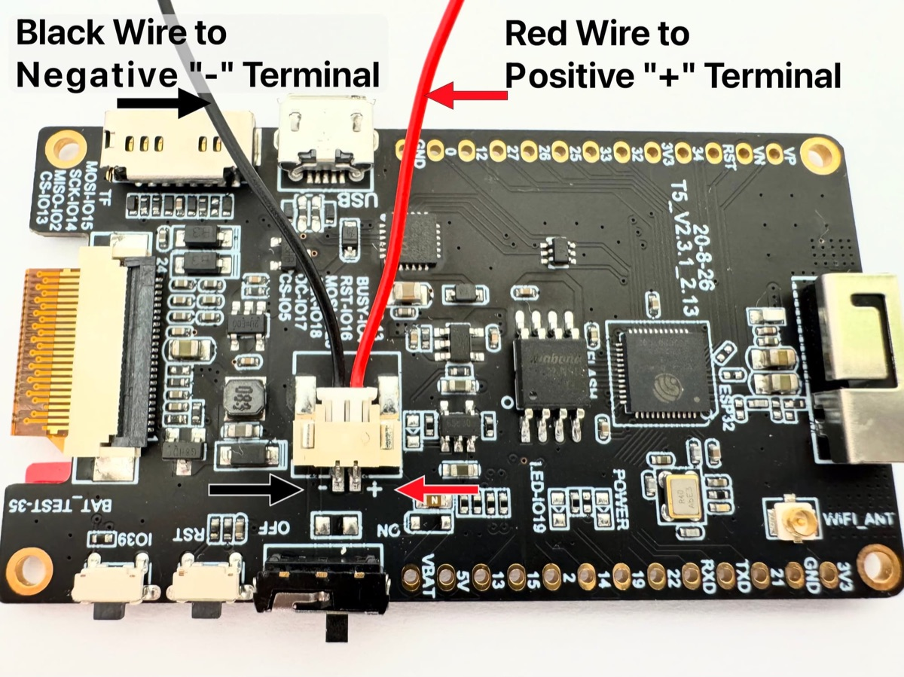
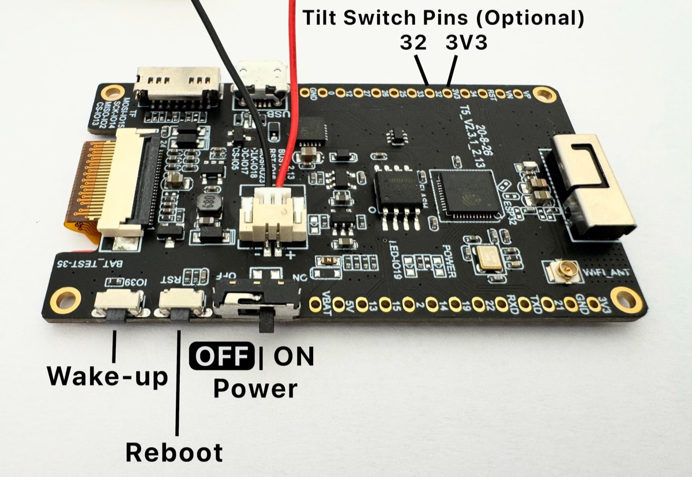

> For Lightning Piggy p1 click [here](/build/p1)!
Making your very own Lightning Piggy is squealy easy. Here are the steps you need to follow:

1. Source the parts.
2. Create a wallet.
3. [Flash the firmware](#3-flash-the-firmware).
4. Connect to and configure your piggy.
5. Make a [case](/build/cases) and assemble the parts.

💡 IMPORTANT: This is not a toy. It contains small parts which could be a choking and ingestion hazard. There are also sharp edges. It should not be handled by children under 4 years of age. Assembly and use of this product is at your own risk. We take no responsibility for any losses that may be incurred.

---

## Quick Start Guide

If you already have the single board computer, follow these steps:

1. Choose a wallet that supports Nostr Wallet Connect (NWC).
   - **For beginners:** We recommend [Coinos](https://coinos.io) - it's simple and custodial (with the option to auto-withdraw to cold storage), so you can get started quickly.
   - **For a non-custodial setup:** We recommend [LNbits](https://lnbits.com/) or [Alby Hub](https://albyhub.com/) - both support multiple friends and family accounts and are easy to use.

   Once your wallet is set up, copy your **Lightning Address** and **NWC link** - you'll need both in the next step.

2. [Flash the firmware](#3-flash-the-firmware) using the installer below. You'll need a Wi-Fi enabled computer with Chrome, Brave, Opera, or Edge browser.

3. Connect to and configure your Piggy (see [Accessing Piggy's Configuration Settings](#accessing-piggys-configuration-settings) below).

---

## Full Guide

### 1. Source the parts

**Single Board Computer (SBC):** LILYGO T5 V2.3.1 e-paper device with a 2.13 inch screen (DEPG0213BN) and a 9102 chip. Available direct from [LILYGo](https://www.lilygo.cc/lightningpiggy) or from resellers.

**Rechargeable battery:** Voltage: 3.7V Connector: JST 2pin 1.25mm. Available from...

- [Rokland](https://store.rokland.com/products/3-7v-1100mah-lithium-rechargeable-battery-1s-1c-lipo-battery-with-protection-board-with-micro-jst-1-25-plug?_pos=1&_sid=9c49fadc8&_ss=r) 1100mAh.

- [Aliexpress](https://www.aliexpress.com/item/32863844546.html) 1200mAh.

- [MakerFocus](https://www.makerfocus.com/products/4pcs-952540-3-7v-1000mah-battery-with-jst1-25-connector-lithium-rechargeable-battery) 1000mAh. Note: The size of this battery 26 *44* 9 mm (1.02 *1.73* 0.35 inch) doesn't fit perfectly in the Genesis and Robotechy pig cases.

**Case:** One homemade case using materials of your choice.

**Micro USB data cable:** Available cheaply for bulk purchases from [Aliexpress](https://www.aliexpress.com) or [Amazon](http://amazon.com) if you don't have one lying around.

💡 IMPORTANT: Improper assembly and/or the use of improper/faulty batteries can present a fire hazard. We recommend using only high quality LiPo rechargeable batteries. **Before** connecting the battery, check the connector is correctly wired. The red wire needs to align with the positive "+" terminal, and the black wire needs to align with the negative "-" terminal. If the battery you have sourced has the polarity switched, it's possible to swap the wires by carefully lifting the plastic JST connector retainers.


*Before connecting the battery, check the connector is correctly wired.*

> **Note:** The device can operate without a battery if powered via the micro USB port.

Here's an image showing your piggy's controls:


*Lightning Piggy's Controls*

If you'd like to add a tilt switch, simply solder it between pins 32 and 3V3. Any standard tilt switches will work; for example, the SW-520D ball switch is a suitable option.

### 2. Create a Wallet

Choose one of two options for connecting your piggy:

You have two options for connecting your piggy:

- [**NWC**](https://nwc.dev/) (Nostr Wallet Connect) - A protocol that lets you securely link your Bitcoin wallet to applications without exposing your private keys. Simple and safe.
- [**LNBits**](https://lnbits.com/) - A versatile wallet and payment processing system for the Lightning Network, offering more control and customisation.

Below is a detailed comparison:

| Feature | NWC | LNBits |
|---------|-----|--------|
| **Purpose** | Protocol for connecting Lightning wallets to apps via Nostr | Multi-wallet Lightning account system |
| **Prerequisites** | No server required, just a NWC-compatible wallet | Requires hosting a server or using a hosted instance |
| **Ease of Use** | Easy! Copy and paste NWC link | Requires LNBits instance setup |
| **Custodianship** | Non-custodial and custodial options | Non-custodial (self-hosted) or custodial |
| **Wallet Support** | Any NWC-enabled wallet | Internal + NWC via extension |
| **Best For** | Simple wallet connection | Self-hosted, multiple accounts, extensions |

### Nostr Wallet Connect

Choose an NWC-enabled wallet and follow the provider's setup instructions. Here are some popular options:

| Wallet | Description |
|--------|-------------|
| [Alby Hub](https://albyhub.com/) | Self-custodial, open-source lightning wallet that connects to apps |
| [Cashu](https://wallet.cashu.me) | Free, open-source Bitcoin wallet that uses ecash |
| [Coinos](https://coinos.io/) | Free custodial web wallet and payment page |
| [Primal](https://primal.net/) | Popular nostr client with integrated custodial wallet |
| [Zeus](https://zeusln.com/) | Self-custodial, open-source Bitcoin wallet |

Go to the NWC information page in your chosen wallet (usually found in the settings). Locate and copy the NWC link, which should follow this structure:

```
nostr+walletconnect://f3a192b445cd7e8f2d4a60c578eb932a57b83d9265fa790042bd865937c2e5d9?relay=wss%3A%2F%2Frelay.example.com&secret=11d4fc982746ab5389f75efc3ddaa94761e35fb209ec8d7a4b3d248ac4e6f710&lud16=RandomWallet@domain.com
```

Keep a record of your wallet’s Lightning address (which resembles an email address), as it will be used to receive bitcoin payments over the lightning network. This address will be automatically converted into a QR code and displayed on the Piggy's screen for easy scanning.

### LNbits

If you wish to run a LNbits wallet, please refer to our detailed [guide](/build/lnbits) for step-by-step instructions.

### 3. Flash the firmware

Connect your Lightning Piggy to your computer with a USB data cable (some USB cables only supply power - if nothing happens, try a different cable).

<div id="flash-browser-check"></div>

<script type="module" src="https://unpkg.com/esp-web-tools@10/dist/web/install-button.js?module"></script>

<div style="text-align:center; margin: 1.5em 0;">
  <div id="flash-version" style="font-size:14px;color:#666;margin-bottom:8px;"></div>
  <esp-web-install-button manifest="https://lightningpiggy.github.io/manifests/manifest_ttgo_lilygo_2.13_and_2.66_inch_epaper_6.x.json"></esp-web-install-button>
</div>

<script>
(function() {
  fetch('https://lightningpiggy.github.io/manifests/manifest_ttgo_lilygo_2.13_and_2.66_inch_epaper_6.x.json')
    .then(function(r) { return r.json(); })
    .then(function(data) {
      var el = document.getElementById('flash-version');
      if (el && data.version) {
        el.textContent = 'Firmware ' + data.version + ' - ' + data.name;
      }
    })
    .catch(function() {});
})();
</script>

<script>
(function() {
  var el = document.getElementById('flash-browser-check');
  if (!el) return;
  if ('serial' in navigator) {
    el.innerHTML = '<div style="background:#f0fdf4;border:1px solid #bbf7d0;border-radius:12px;padding:12px 16px;margin-bottom:1em;font-size:14px;color:#166534;display:flex;align-items:center;gap:8px;"><svg width="20" height="20" fill="none" stroke="currentColor" viewBox="0 0 24 24"><path stroke-linecap="round" stroke-linejoin="round" stroke-width="2" d="M9 12l2 2 4-4m6 2a9 9 0 11-18 0 9 9 0 0118 0z"/></svg> Your browser supports the Web Serial API. You\'re good to go!</div>';
  } else {
    var ua = navigator.userAgent;
    var name = 'Your browser';
    if (ua.includes('Firefox')) name = 'Firefox';
    else if (ua.includes('Safari') && !ua.includes('Chrome')) name = 'Safari';
    el.innerHTML = '<div style="background:#fefce8;border:1px solid #fde68a;border-radius:12px;padding:12px 16px;margin-bottom:1em;font-size:14px;color:#92400e;display:flex;align-items:center;gap:8px;"><svg width="20" height="20" fill="none" stroke="currentColor" viewBox="0 0 24 24"><path stroke-linecap="round" stroke-linejoin="round" stroke-width="2" d="M12 9v2m0 4h.01m-6.938 4h13.856c1.54 0 2.502-1.667 1.732-3L13.732 4c-.77-1.333-2.694-1.333-3.464 0L3.34 16c-.77 1.333.192 3 1.732 3z"/></svg> <strong>' + name + '</strong> does not support the Web Serial API. Please use <a href="https://www.google.com/chrome/" style="color:#92400e;text-decoration:underline;">Chrome</a>, <a href="https://www.microsoft.com/edge" style="color:#92400e;text-decoration:underline;">Edge</a>, or <a href="https://brave.com/" style="color:#92400e;text-decoration:underline;">Brave</a> to flash firmware.</div>';
  }
})();
</script>

When prompted, select the serial port - usually the one labelled "CP210" (that's the USB-to-Serial chip in the device). Click **Install** and wait for the process to complete. Don't unplug your device during installation.

Once installed, the device will automatically reboot with its Wi-Fi access point enabled for approximately 20 seconds, allowing you to connect and configure the software.

### 4. Connect to and configure your piggy

If you don't see the **Piggy Config** access point in your available Wi-Fi networks after updating the software, press and hold the IO39 (Wake-up) button for at least 3 seconds to activate it.


*Lightning Piggy's Controls*

Please note, since the piggy's access point doesn't provide internet access, the device you're using to connect to it may automatically disconnect after a period of inactivity. It is worth preparing your credentials (summarised below) in advance for easy copy and paste.

| Connection | Required Credentials |
|------------|---------------------|
| **WiFi** | SSID, Password |
| **NWC** | NWC link (e.g., `nostr+walletconnect://...`), Lightning address |
| **or LNBits** | Server name (e.g., `https://my.lnbits.com/`), Invoice/read key |

---

### Accessing Piggy's Configuration Settings

**1. Activate Piggy's Wi-Fi access point**

On another device (e.g., a laptop or smartphone), press and hold Piggy's **IO39 (Wake-up)** button for at least 3 seconds. A "Starting wireless Access Point for configuration..." message will appear on Piggy's display.

**2. Connect to the "Piggy Config" Wi-Fi network**

After a few seconds, a new Wi-Fi network called **Piggy Config** will appear in your device's Wi-Fi settings. Connect to it.

Piggy's screen will display:

- The **web address** to open in your browser (e.g., `http://192.168.4.1/`)
- The **login credentials** - username: `piggy`, password: `oinkoink`

**3. Open the configuration page**

In your browser, navigate to the web address shown on Piggy's screen. Log in using the credentials above, then:

1. Enter your **Wi-Fi network** details.
2. Enter your **NWC (Nostr Wallet Connect)** or **LNbits** credentials.
3. Click **Save**.
4. Restart the device.

The device should now connect to your Wi-Fi network and display your satoshi balance, QR code to receive lightning payments, and list your recent transactions (if any).

> **Notes:**
>
> - Starting from version 5, your Piggy will remember its configuration settings even after a software update. You won't need to re-enter them, as long as you don't choose to erase the device during installation.
> - If you're powering the Piggy via USB, you can enable the "Always run webserver" option in the settings. This keeps the Wi-Fi access point active, making it easier to reconnect anytime.

### 5. Make a case and assemble the parts

Time to get creative! Build your very own Lightning Piggy case out of any material you wish to use, and assemble the parts.

💡 IMPORTANT: When installed correctly, the battery and/or board components should not get hot when it is being charged (i.e. the USB is connected to power and the battery is installed).

Check out our [case options](/build/cases).

If you would like to share your design with others, please either email your creation to [oink@lightningpiggy.com](mailto:oink@lightningpiggy.com), or post a note on nostr with a photo of your piggy, including the hashtag **#zapmypiggy** for inclusion on this website.

---
Join our <a href="https://t.me/+Y2zSiQELdXxhZDlk" target="_blank" rel="noopener noreferrer">telegram chat</a> for help or inspiration, or to share your work with other Lightning Piggy builders.
