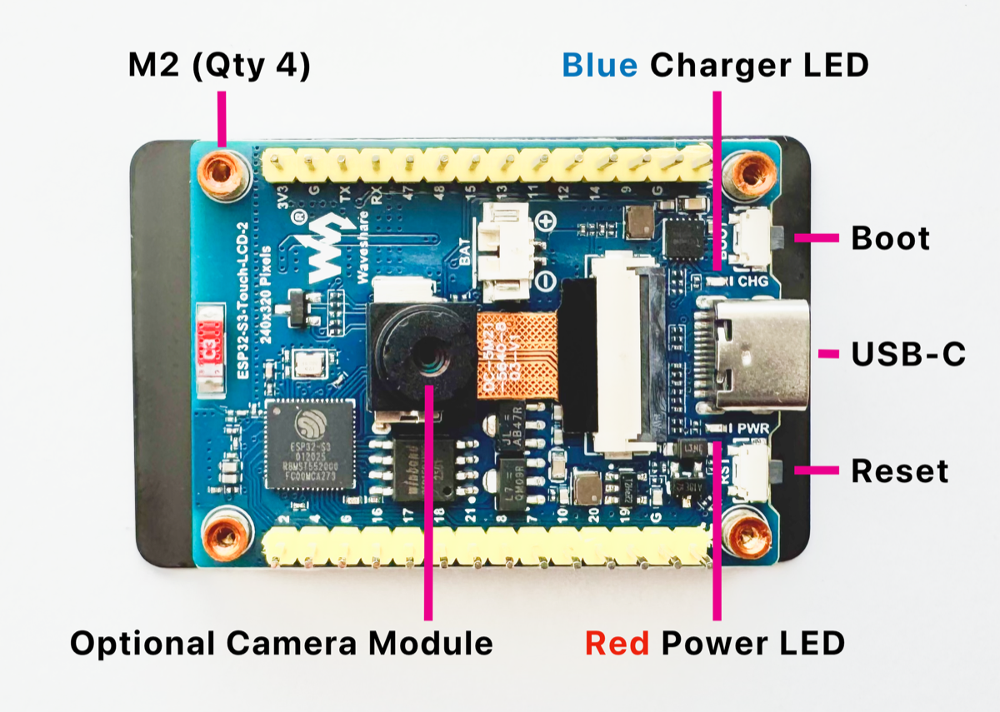

> For Lightning Piggy v1 click [here](/build/v1).
Making your very own Lightning Piggy is squealy easy. Here are the steps you need to follow:

1. Source the parts.
2. Create a wallet.
3. [Flash](https://install.micropythonos.com/) the firmware.
4. Make a [case](/build/cases) and assemble the parts.

💡IMPORTANT: This is not a toy. It contains small parts which could be a choking and ingestion hazard. There are also sharp edges. It should not be handled by children under 4 years of age. Assembly and use of this product is at your own risk. We take no responsibility for any losses that may be incurred.
---

## Quick Start Guide

If you already have the single board computer.

Choose a wallet that supports Nostr Wallet Connect (NWC). We recommend [Alby Hub](https://albyhub.com/) because it's self-hosted; supports multiple friends and family accounts, and is super easy to use. Once setup, make a copy of the **Lightning Address** and **NWC link**, you’ll need them in the next step.

Next flash the firmware. You’ll need:

- A Wi-Fi enabled laptop/desktop computer.

- A browser that supports the Web Serial API (such as Google Chrome, Brave, Opera, or Microsoft Edge).

- Your Lightning Piggy configuration details (summarised below) ready to copy and paste into the setup webpage.

**Connection**
**Required Credentials**

**WiFi**
- **SSID**   
 - **Password**

**NWC**
- **NWC link** e.g., `nostr+walletconnect://ba80990666ef0b...`   
 - **Lightning address** e.g., `LightningPiggy@coinos.io`

The **Lightning Piggy v2 app** runs on [MicroPythonOS](https://micropythonos.com/)** - **a new lightweight, fast, and versatile operating system designed for both microcontrollers and desktop systems.

> MicroPythonOS was created by [Thomas](https://github.com/ThomasFarstrike), our lead developer, during the development of Lightning Piggy. It grew out of a need for a fast, flexible, learner-friendly OS tailored to microcontrollers.
To get started:

1. **Flash MicroPythonOS** to your device using this [web installer](https://install.micropythonos.com/).
2. Connect your device to a **Wi-Fi network**.
3. Open the **AppStore** and install the **Lightning Piggy app**.
4. In the app, tap the **Settings** button and select **Nostr Wallet Connect (NWC)** as your wallet type.
5. Enter your NWC credentials manually or scan the relevant QR code using the built-in camera module.

💡 *Tip:* To improve QR code detection, zoom in on the code in your browser to make it as large and clear as possible.

---

## Full Guide

### 1. Source the parts

**Single Board Computer (SBC):** WaveShare ESP32-S3-Touch with a 2inch screen. Available direct from [WaveShare](https://www.waveshare.com/esp32-s3-touch-lcd-2.htm) or from resellers.

**Case:** One homemade case using materials of your choice.

**USB-C data cable:** Available cheaply for bulk purchases from [Aliexpress](https://www.aliexpress.com) or [Amazon](http://amazon.com) if you don't have one lying around. 


*ESP32-S3-Touch with a 2inch screen*

### 2. Create a Wallet

Choose one of two options for connecting your piggy:

**Use a Nostr Wallet Connect (NWC)-enabled wallet. Or, set up an LNBits wallet.**

[**NWC**](https://nwc.dev/) is a protocol that lets you securely link your Bitcoin wallet to applications without exposing your private keys, making it a simple and safe option.

[**LNBits**](https://lnbits.com/) is a versatile wallet and payment processing system for the Lightning Network, offering more control and customisation.

Below is a detailed comparison of both options to help you choose the best fit.

**NWC**
**LNBits**

**Purpose**
Protocol for connecting Lightning wallets to apps via Nostr
Multi-wallet Lightning account system

**Prerequisites**
Works with Nostr, no server required, just a NWC-compatible wallet
Requires hosting a server (trustless) or using a hosted instance (trusted)

**Ease of Use**
**Easy!** Copy and paste NWC link to connect a wallet
Requires the setup of, or access to, an LNBits instance

**Custodianship**
Both non-custodial and custodial options, the Lightning Piggy software only views payments
Both non-custodial (if self-hosted) and custodial (if using a hosted instance)

**Wallet Support**
Works with any NWC-enabled wallet (See below)
Internal to LNBits but can also be connected to a NWC-enabled wallet through LNbits

**Best For**
Great for connecting a regular NWC-enabled wallet with your piggy
Self-hosted Lightning wallets, managing multiple accounts from one interface, access to additional extension-based LNBits functionality

### Nostr Wallet Connect

Choose an NWC-enabled wallet and follow the provider’s setup instructions. Below is a summary of some popular wallet options.

Wallet
**Description**

[Alby Hub](https://albyhub.com/)
A self-custodial, open-source lightning wallet that connects to apps

[Cashu](https://wallet.cashu.me)
A free and open-source Bitcoin wallet that uses ecash

[Coinos](https://coinos.io/)
A free custodial web wallet and payment page

[Primal](https://primal.net/)
A popular nostr client with integrated custodial wallet

[Zeus](https://zeusln.com/)
A self-custodial, open-source Bitcoin wallet

Go to the NWC information page in your chosen wallet (usually found in the settings). Locate and copy the NWC link, which should follow this structure:

```
nostr+walletconnect://f3a192b445cd7e8f2d4a60c578eb932a57b83d9265fa790042bd865937c2e5d9?relay=wss%3A%2F%2Frelay.example.com&secret=11d4fc982746ab5389f75efc3ddaa94761e35fb209ec8d7a4b3d248ac4e6f710&lud16=RandomWallet@domain.com
```
Keep a record of your wallet’s Lightning address (which resembles an email address), as it will be used to receive bitcoin payments over the lightning network. This address will be automatically converted into a QR code and displayed on the Piggy's screen for easy scanning.

### LNbits

If you wish to run a LNbits wallet, please refer to our detailed [guide](/build/lnbits) for step-by-step instructions.

### 3. Flash the firmware

You’ll need a Wi-Fi enabled laptop/desktop computer, a browser that supports the Web Serial API (such as Google Chrome, Brave, Opera, or Microsoft Edge), and your LightningPiggy configuration details (summarised below) ready to copy and paste into the setup webpage.

**Connection**
**Required Credentials**

**WiFi**
- **SSID**   
 - **Password**

**NWC**
- **NWC link** e.g., `nostr+walletconnect://ba80990666ef0b...`   
 - **Lightning address** e.g., `LightningPiggy@coinos.io`

**or LNBits**
- **Server name** (e.g., `https://demo.lnpiggy.com`)   
 - **Invoice/read key** (e.g., `db400dfba...`, copied from your LNBits Wallet API toggle)

The **Lightning Piggy v2 app** runs on [MicroPythonOS](https://micropythonos.com/)** - **a new lightweight, fast, and versatile operating system designed for both microcontrollers and desktop systems.

> MicroPythonOS was created by [Thomas](https://github.com/ThomasFarstrike), our lead developer, during the development of Lightning Piggy. It grew out of a need for a fast, flexible, learner-friendly OS tailored to microcontrollers.
To get started:

1. **Flash MicroPythonOS** to your device using this [web installer](https://install.micropythonos.com/).
2. Connect your device to a **Wi-Fi network**.
3. Open the **AppStore** and install the **Lightning Piggy app**.
4. In the app, tap the **Settings** button and select **Nostr Wallet Connect (NWC)** as your wallet type.
5. Enter your NWC credentials manually or scan the relevant QR code using the built-in camera module.

💡 *Tip:* To improve QR code detection, zoom in on the code in your browser to make it as large and clear as possible.

---

### 4. Make a case and assemble the parts

Time to get creative! Build your very own Lightning Piggy case out of any material you wish to use, and assemble the parts.

Check out our new case options.

[Cases](/build/cases)If you would like to share your design with others, please email your creation to [oink@lightningpiggy.com](mailto: oink@lightningpiggy.com) for inclusion on this website.

---
Join our <a href="https://t.me/+Y2zSiQELdXxhZDlk" target="_blank" rel="noopener noreferrer">telegram chat</a> for help or inspiration, or to share your work with other Lightning Piggy builders.