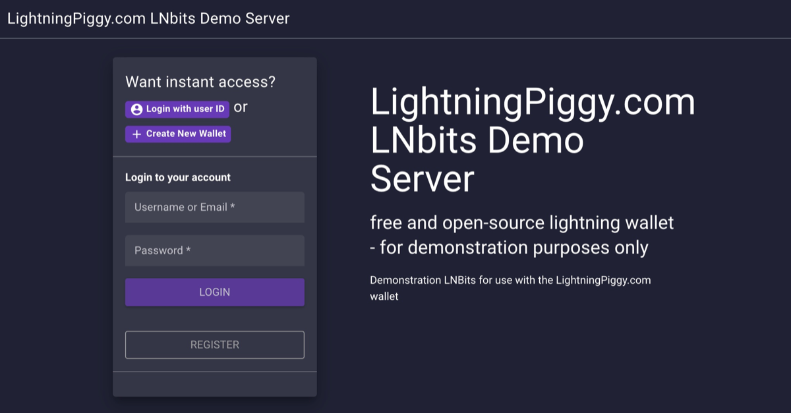
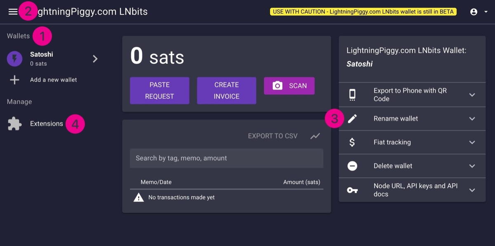
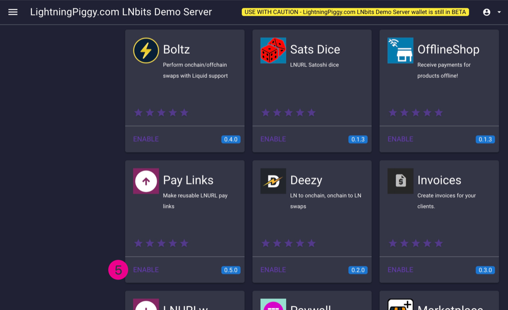
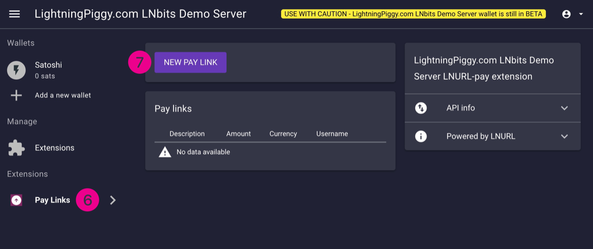
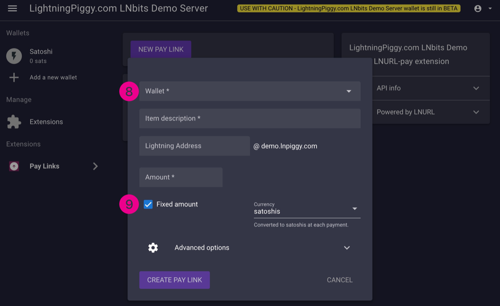
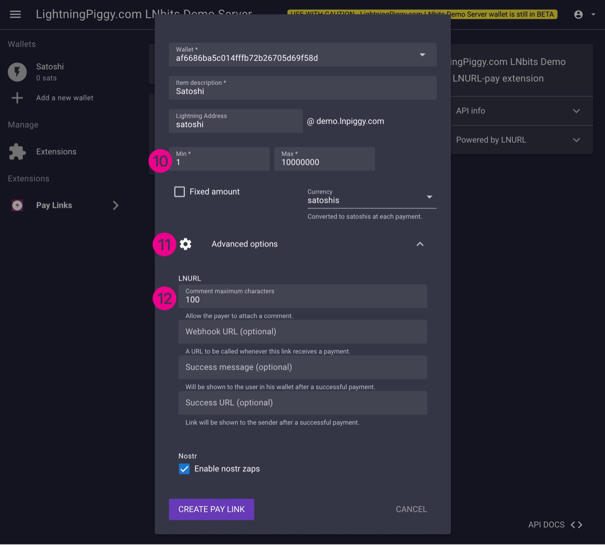
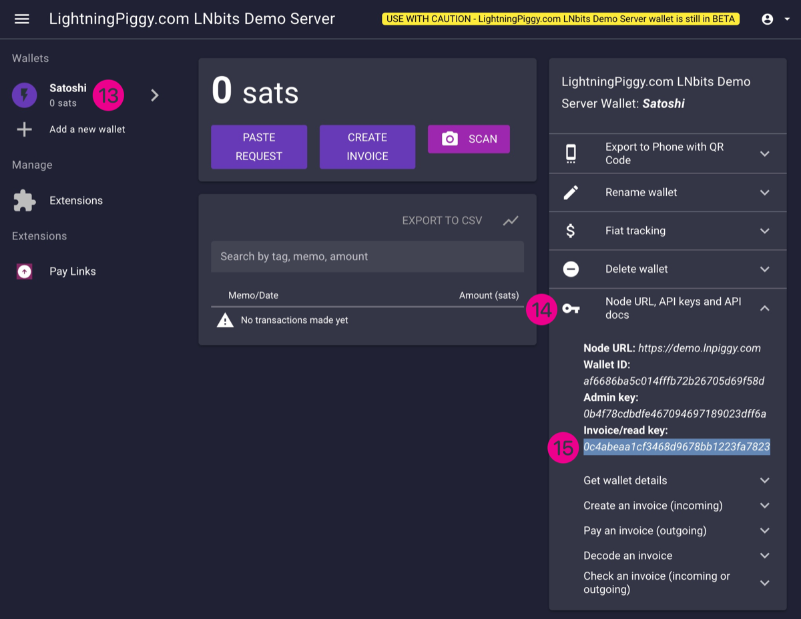

LNbits is a versatile wallet and account management solution for the Lightning Network. It can be configured to work with a wide variety of funding sources, offering flexibility for different user needs. Built on top of the Lightning Network protocol, which itself operates on the Bitcoin protocol, LNbits seamlessly integrates with this new global financial system.

Here are three options for running LNbits, depending on your technical expertise and goals:

**a) Running LNbits on your *own hardware*.**

This option is ideal for users comfortable with the technical aspects of managing their own node and seeking a fully independent solution.

**Pros**

- Complete self-sovereignty: You retain full control over your node and data.
- Utilises your own hardware for maximum privacy and independence.

**Cons**

- Difficult to set up for the purpose of connecting your LightingPiggy to interact with the outside world.
- Ideally needs dedicated hardware, such as a Raspberry Pi or a compatible server, to operate effectively.

How: Install bitcoin, lightning and LNbits on your dedicated hardware device such as your own computer/server, [Raspiblitz](https://raspiblitz.org), [Start 9](https://start9.com) or [Umbrel](https://umbrel.com) device. Please refer to the set-up and configuration instructions provided by your hardware node supplier.

**b) Running LNbits on Someone Else’s Hardware While Retaining Custody of Your Funds. **Recommended!

This setup strikes a balance between control and convenience and is ideal for those who want a simpler yet sovereign solution, with the added flexibility and power of a VPS. In fact, we use this configuration for our demo server.

**Pros**

- Maintains full self-sovereignty over your funds.
- Easier to set-up and maintain compared to running a node on your own hardware.

**Cons**

- Requires some technical knowledge to configure.
- Involves some additional fees (only a few sats) for a Virtual Private Server (VPS) and a Lightning Service Provider (LSP) for channel and liquidity management.

How: Check out this excellent guide from [Ereignishorizont](https://ereignishorizont.xyz/blitzbank/en/).

**c) Using an LNbits Service Provider in the Cloud.**

This is the quickest and easiest way to get started with LNbits. It's great for beginners or those who want to test LNbits features before committing to a more self-sovereign setup.

**Pros**

- Fast and simple: No setup or technical knowledge required.
- Immediate access: You can quickly explore and use LNbits features without delay.

**Cons**

- Third-party reliance: Your funds and data depend on the security and trustworthiness of the service provider.
- Reduced privacy and control: Not as secure or private as self-hosting.
- “Not your keys, not your coins”: You don’t have full custody of your funds.
- Service fees: Some providers may charge fees for usage.

How: Visit [LNbits](https://lnbits.com/) or [egg](https://www.eggstr.com/) or any other trusted public instance and start using it without any complicated set-up or maintenance.

> **For testing (with small amounts) here is a **[**LNbits demo server**](https://demo.lnpiggy.com/?ref=lightningpiggy.com)** instance.**

---
Select *create a new wallet*, give it a name (we'll use Satoshi in this example), and follow the on screen instructions.

> Be sure to bookmark/save the wallet webpage otherwise the wallet is unrecoverable.
A wallet list should be show on the lefthand side of the page (1), if not expand the page, or click the *burger icon* in the top lefthand corner of the screen (2).

Give your wallet a name using the *Rename wallet* button (3) if you didn't already do this at the beginning.

Under the *Wallets* header should be *Extensions* (4). Click this and find the *Pay Links* extension (5). Enable it by clicking *Enable*.

Now the Pay Links extension will appear under your wallets' list (6). Click it and select *New Pay Link* (7).

Choose your wallet from the dropdown list (8), give it a description (the name of your child for example), and add a Lightning Address if you wish. Deselect *Fixed amount* (9) and configure the *Min* and *Max* amounts of satoshis your wallet can receive.

We suggest using 1 Min and 10,000,000 Max (10). Click to expand the *Advanced options* area (11), and enter the maximum number of characters you wish to allow when someone leaves a message with a payment in the *Comment maximum characters box* (12). We recommend using 100. *Enable nostr zaps* if you wish and then click *Create Pay Link* to save the settings.

Your LNURLp payment link will now be attached to your wallet.

Next we need to flash the piggy with the latest software. Click the pertinent link below to proceed.

👉 [LightingPiggy v1](https://lightningpiggy.github.io/)

👉 [LightingPiggy v2](https://install.micropythonos.com/)

> Return to this window when you have installed the firmware.
Now the piggy firmware is installed, click on your wallet name (13) and expand the API docs list on the righthand side of the page (14).

We need to add the *Node URL* and the* Invoice/Read key* (15) for this wallet to the physical piggy. The easiest way to do this is by having the piggy scan a QR code for each data point - unless you're good at typing on the tiny onscreen keyboard.

Congratulations! 🥳 If everything has gone to plan, your piggy is now ready to receive zaps and display your sat balance. If you run into any issues or have questions, feel free to reach out in our community [Telegram group](https://t.me/LightningPiggy), we’re always happy to help.