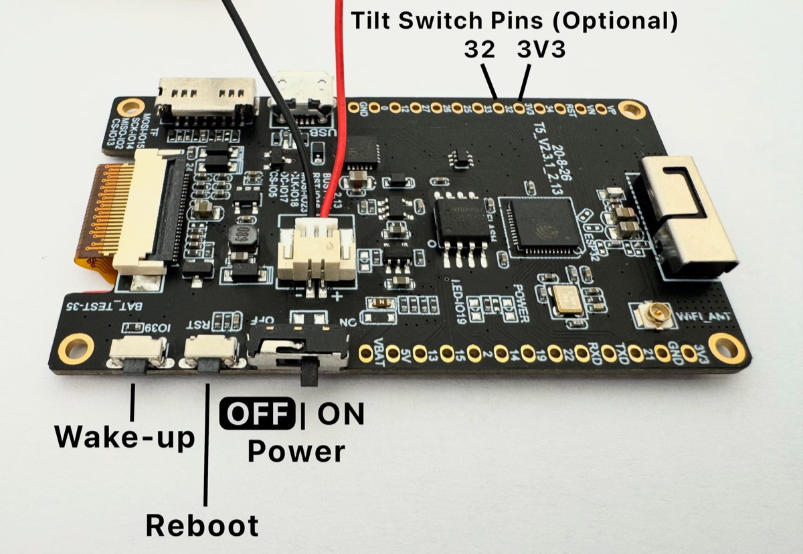

## Preparation

### Sourcing Parts

LILYGO T5 V2.3.1 (2.13 inch screen) e-paper device: [AliExpress](https://www.lilygo.cc/lightningpiggy)

### Creating an LNbits Wallet

We recommend setting up LNbits on your own node such as a [Raspiblitz](https://raspiblitz.org), [Start 9](https://start9.com) or an [Umbrel](https://umbrel.com). Please follow the set-up instructions provided by the node provider.

For testing (with small amounts) here is a [LNbits demo server](https://demo.lnbits.com/?ref=lightningpiggy.com) instance. Please note this software is in BETA and you will need to bookmark/save the webpage for future access to any sats you leave there.

---

## Set-up

### Connecting your device

Nothing happens when I plug the device into the computer.

*Ensure you are using a USB cable that can transmit data. Many micro USB cables only supply power and lack data transmission capabilities. Often, these cables have no distinguishing markings, so the simplest method to determine if your cable supports data transfer is to connect a memory device (like a data drive) to the computer using the cable and check if the computer recognizes the data drive.*

### Flashing the Firmware

Use our custom built [web installer](https://lightningpiggy.github.io/) to configure and flash the firmware to the device.

### LILYGO TTGO T5 2.66 inch E-paper device

The device does not turn on (device leds stay dark) when connected to my computer.

1. *Check you have a USB to TTL (T-U2T) connector connected between the device and your USB cable.*
2. *Check the device is not faulty by connecting it to a power supply, instead of the computer. The red power led should light up.*

---

## Operating

### Device Display Information

The screen only displays "0 sats" i.e. there is no QR code on the screen to scan.

*Check that you enabled and configured the LNURLp extension during the wallet set-up.*

"NOBAT" is displayed on the screen, even though a charged battery is connected.

*The system's battery detection relies on heuristics and is not always 100% accurate. Rapid voltage fluctuations lead to an assumption that the device is not on battery power, while very stable voltage suggests that it is running on the battery. If the battery is charged and you have a power cable connected, try disconnecting the power cable. Alternatively, if you wish to power the device by an external source (USB power), disconnect the device battery.*

### Battery

Unsure if the battery is working correctly?

*To check that the battery is working correctly, unplug any connected USB power source and press the reboot button so that the device boots while on battery power.*

*Lilygo T5 2.13 inch Controls*

---

## Advanced

### Building From Source

MacOS iCloud and Arduino library conflicts

*Arduino library folder Conflicts: It has been noted in Arduino version 1.8.16 that conflicts can occur due to the iCloud upload status of files in the Arduino library folder that can prevent successful builds. One solution is wait until all folders and files have synchronised with iCloud before building.*